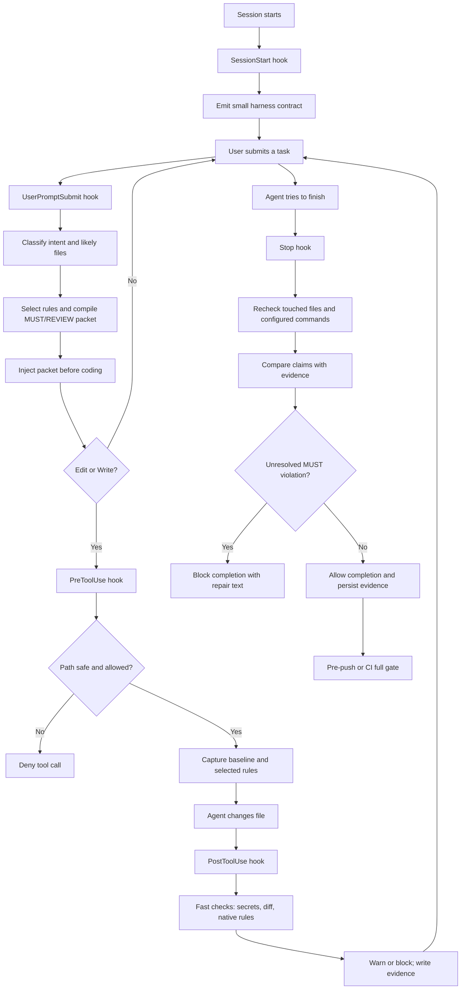

# LGTM

`lgtm` adds automated engineering checks to agent workflows. It checks edits, blocks unresolved policy violations before completion, and records what was actually verified.

The current release supports Python, TypeScript/JavaScript, Rust, Go, shell,
Terraform, JVM, C#, C/C++, SQL, and mixed repositories on x86_64 Linux and macOS.

## Quick Install

Linux and macOS:

```bash
curl -fsSL https://raw.githubusercontent.com/tcbuilds/lgtm/main/scripts/install.sh | sh
lgtm --version
```

This downloads the latest release, verifies its SHA-256 checksum, and installs `lgtm` to `~/.local/bin`. Add that directory to `PATH` if needed:

```bash
echo 'export PATH="$HOME/.local/bin:$PATH"' >> ~/.bashrc # or ~/.zshrc
```

To install from source instead, use Rust:

```bash
cargo install --git https://github.com/tcbuilds/lgtm
```

## Initialize a Project

From the Python repository you want to protect:

```bash
lgtm init
lgtm doctor
```

`lgtm init` adds the project configuration and Claude Code hooks without replacing existing settings. `lgtm doctor` shows any optional checking tools you still need to install, including `gitleaks`, `ruff`, and `semgrep`.

Commit the generated `.lgtm/config.json`, `.claude/settings.json`, and `.gitignore` changes. Claude Code will run LGTM automatically during future sessions.

## How the Hooks Work

The `lgtm` binary is the enforcement engine. It is not a background service.
The repository's `.claude/settings.json` tells Claude Code when to start it:

```text
Claude event
    ↓
.claude/settings.json hook
    ↓
lgtm hook <event>
    ↓
select relevant rules → guide the agent → check the change → allow or block
```

At the start of a session, LGTM gives the agent a small permanent contract.
When you submit a task, it selects only the relevant standards and sends a
compact MUST/REVIEW packet before coding begins. Before an Edit or Write, it
checks the target path and records a baseline. After edits, fast checks run;
pushes and CI can run the full gate. You can also run the binary directly with
`lgtm check --tier full`.

### A concrete prompt

Imagine you send this to Claude Code:

```text
Fix the timeout bug in src/api/orders.py. Add a regression test, keep the
request bounded, and run the relevant checks before you finish.
```

LGTM does not paste all of `codingStandards.md` into the conversation. It
classifies the words `fix` and `timeout` as a bug-fix task, notices the Python
file, and selects the small set of rules about regression tests, external-call
timeouts, error handling, and verification evidence. The agent receives a
compact packet like this (simplified):

```text
Detected task intent: bug-fix.

MUST: Add a regression test that fails before the repair and passes after it.
MUST: Bound the external request with a timeout and cancellation path.
MUST: Do not claim checks passed without current evidence.
REVIEW: Keep the change small and preserve unrelated user edits.
```

The packet guides the agent before it writes code. The later hooks are the
independent verification layer; they do not trust the agent's promise that it
followed the packet.

### Full lifecycle, step by step



The five Claude events have different jobs:

| Event | Job | Typical result |
| --- | --- | --- |
| `SessionStart` | Detect the repo and provide the permanent contract. | Context injection |
| `UserPromptSubmit` | Classify intent and inject only relevant policy. | Context injection |
| `PreToolUse` | Protect paths, prohibited files, and the pre-edit baseline. | Allow or deny |
| `PostToolUse` | Give quick feedback after each edit and record findings. | Warning or block |
| `Stop` | Re-run final checks, inspect the diff, verify claims, and decide completion. | Allow or block |

Evidence is written locally under `.lgtm/evidence/`. It records what ran, its
exit status, touched files, findings, and policy decisions. It is a ledger for
the current repository—not a hidden upload to the lgtm project.

### What LGTM can and cannot prove

LGTM can prove that configured commands ran, that a check found a violation,
and that a matching test file changed when its test-association rule applies.
It cannot prove that a test fully understands new business behavior or that a
subjective design choice is “good.” Those remain review findings. A passing
test suite is evidence that tests passed; it is not proof that the right test
was added.

## Context Efficiency

LGTM avoids pasting the full standards document into every agent turn. A
representative tokenizer benchmark measured these payloads:

| Payload | Tokens |
| --- | ---: |
| Full standards document | 4,263 |
| Session-start contract | 136 |
| Bug-fix Rust policy packet | 518 |
| Feature Rust policy packet | 460 |

That makes the standards portion of a turn about 85–86% smaller: roughly
3,600 tokens saved per prompt. The session contract is sent at session start;
later prompts usually receive only the smaller, task-specific packet. Across a
20-turn session, this can save roughly 70,000–75,000 standards tokens.

These are measured standards-only values using an OpenAI-compatible tokenizer.
Actual total context also includes conversation history, code, and tool output.

For Codex, Git hooks, or CI, run the same checks directly:

```bash
lgtm check --tier full
```

See [the Codex adapter contract](doc/adapters/codex.md) for exit statuses and
platform limits.

Claude Stop hooks run fast, touched-workspace gates by default. Run
`lgtm check --tier full` at a push/CI boundary to execute tests, builds, and
coverage without paying that cost at every conversation stop.

To make pushes run the full gate locally, copy
[`scripts/lgtm-pre-push`](scripts/lgtm-pre-push) into a versioned hooks directory
and point Git at it:

```bash
mkdir -p .githooks
test ! -e .githooks/pre-push || {
  echo 'Refusing to replace existing .githooks/pre-push' >&2
  exit 1
}
hook_tmp=$(mktemp .githooks/.pre-push.XXXXXX)
curl -fsSL https://raw.githubusercontent.com/tcbuilds/lgtm/main/scripts/lgtm-pre-push \
  -o "$hook_tmp"
chmod 755 "$hook_tmp"
mv "$hook_tmp" .githooks/pre-push
git config core.hooksPath .githooks
```

Keep the repository CI workflow enabled as the final authority; `git push
--no-verify` can bypass local hooks.

## Common Commands

```bash
# Check for or install the latest LGTM release
lgtm update --check
lgtm update

# Check that the bundled policy is valid
lgtm compile --validate

# Show the latest verification report
lgtm report

# Show one task from an evidence file
lgtm report --evidence .lgtm/evidence/evidence.jsonl --task TASK_ID

# Create a temporary, audited exception for an eligible rule
lgtm waive --rule RULE_ID --reason "why" --owner OWNER --expires YYYY-MM-DD
```

LGTM reports unavailable checks as `unverified` instead of claiming they passed. Waivers require an owner, reason, and expiration date. Security-critical rules cannot be waived.

## Development

```bash
cargo fmt --check
cargo clippy --locked --all-targets --all-features -- -D warnings
cargo test --locked --all-targets --all-features
cargo build --locked
```

Read [AGENTS.md](AGENTS.md) for contribution guidelines and [doc/adr/](doc/adr/) for architecture decisions.
